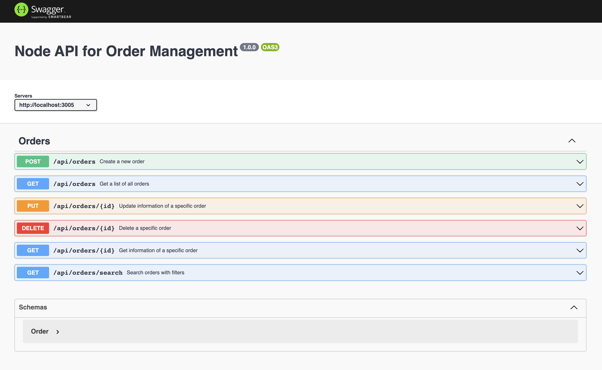

# PROYECTO 4: Reservas Hoteleras

## **ÍNDICE**

* [1. Intro](#1-intro)
* [2. Demo](#2-demo)
* [3. ¿Qué construirás?](#3-qu%C3%A9-construir%C3%A1s)
* [4. Objetivos de Aprendizaje](#4-objetivos-de-aprendizaje)
* [5. Requisitos](#5-requisitos-y-entregables)
* [6. Criterios de evaluación](#6-criterios-de-evaluaci%C3%B3n)
* [7. Entregas](#7-entregas)

****

## 1. Intro
En el camino de convertirte en un `fullstack dev`, aprenderás acerca de la división de responsabilidades en una arquitectura web. Has empleado `Node.js` como la tecnología principal para tu `Backend` en lecciones anteriores, ahora es momento de aplicar estos conocimientos en un proyecto de mundo real.

En el `Backend`, recordarás que utilizamos las operaciones CRUD, que permiten manipular datos y persistirlos, ya sea en una estructura de datos (como haremos en este proyecto), o en una base de datos. Los clientes solicitan o envían información a estos servicios a través de las operaciones CRUD, ya sea a través de una interfaz de usuario en el Frontend o utilizando herramientas como [Postman](https://www.postman.com/), [Insomnia](https://insomnia.rest/) o [ThunderClient](https://www.thunderclient.com/).

En este proyecto, construirás una aplicación de servicios CRUD para la industria hotelera, específicamente para la gestión de reservas. Además, le proporcionaremos un sistema de búsqueda. 

Opcionalmente, añadiremos documentación de la API, para facilitar la colaboración en equipos más grandes.


****

## 2. Demo

Visita la demostración aquí: [LINK](https://github.com/UDDBootcamp/7M_FULLSTACK_M4_PROY/tree/master/demo)

En esta demo, se muestra una aplicación de gestión de pedidos para restaurantes. Te recomendamos revisarla cuidadosamente antes de iniciar este proyecto, para asegurarte de que comprendes todos los requisitos.

La documentación de la API en esta demo utiliza Swagger y OpenAPI. Aunque la documentación es opcional en este proyecto, te alentamos a explorarla.



****

## 3. ¿Qué construirás?

En este proyecto, te encontrarás con dos actividades:

1. Construirás una aplicación de servicios para la gestión de reservas en hoteles que involucre las 4 operaciones `CRUD` y otras 6 adicionales relacionadas con filtros, utilizando Node.js y Express. 

2. Opcionalmente, realizarás un proceso de investigación relacionado con la documentación de API, usando Swagger, con la estandarización OPENAPI, la cual se utiliza en equipos internacionales para construir servicios escalables.

A continuación, determinamos las características del proyecto:

- Utilizar Node.js y Express para el desarrollo del servidor.
- Contar con un archivo `.env` para las variables de entorno, el cual establecerás el puerto.
- Contar con un archivo `.gitignore` que incluya las carpetas y archivos que deberán ocultarse para el repositorio.
- Usar una arquitectura de carpetas clara como se muestra a continuación. Es de tu gusto agregar más archivos, rutas, controladores o, si lo prefieres, sintetizar. La idea es que la asignación de responsabilidades de tu código pueda ser ubicado fácilmente.

```
EJEMPLO_TU_PROYECTO
├─ .env
├─ .prettierrc
├─ README.md
├─ controllers
│  └─ TU_CONTROLADOR.js
├─ package-lock.json
├─ package.json
├─ routes
│  └─ TU_RUTA.js
└─ server.js  <- TU ARCHIVO DE ENTRADA
```

- Implementar los siguientes 10 endpoints. 

|Descripción del Endpoint|	Método|	Endpoint| Ejemplo. Caso de uso. |
|-----------------------|----------|------------|---------|
|Crear reserva	| POST| 	/api/reservas|Como viajero, quiero hacer una reserva en el hotel "Hotel Paraíso" para el 15 de mayo de 2023. Necesito una habitación doble para dos adultos y un niño.
|Obtener la lista de reservas|	GET|	/api/reservas|Como gerente del hotel, quiero ver una lista de todas las reservas para hoy para poder planificar el trabajo del personal de limpieza y recepción.|
|Obtener información de una reserva específica	|GET|	/api/reservas/:id|Como recepcionista, necesito verificar los detalles de la reserva del huésped que acaba de llegar al hotel. Su número de reserva es 12345.
|Actualizar información de una reserva|	PUT|	/api/reservas/:id|Como huésped, necesito cambiar mi reserva en el hotel "Hotel Paraíso". Originalmente reservé una habitación doble, pero ahora necesito una suite familiar. Mi número de reserva es 12345.|
|Eliminar una reserva específica	|DELETE|	/api/reservas/:id|Como viajero, tuve un cambio de planes y ya no necesito la habitación que reservé en el hotel "Hotel Paraíso". Mi número de reserva es 12345.|
|Filtrar reservas por hotel|	GET|	/api/reservas?hotel=HOTEL|Como gerente de una cadena de hoteles, quiero ver todas las reservas para el "Hotel Paraíso" para el próximo mes.|
|Filtrar reservas por rango de fechas|	GET|	/api/reservas?fecha_inicio=FECHA_INICIO&fecha_fin=FECHA_FIN|Como gerente del hotel, quiero ver todas las reservas para la semana de Navidad para poder planificar el personal y las actividades necesarias.|
|Filtrar reservas por tipo de habitación|	GET|	/api/reservas?tipo_habitacion=TIPO_HABITACION|Como gerente del hotel, quiero ver todas las reservas para nuestras suites de lujo para el próximo mes para asegurarme de que todo esté en perfectas condiciones para nuestros huéspedes VIP.|
|Filtrar reservas por estado|	GET|	/api/reservas?estado=ESTADO|Como gerente del hotel, quiero ver todas las reservas que están pendientes de pago para poder hacer un seguimiento con los clientes.|
|Filtrar reservas por número de huéspedes|	GET|	/api/reservas?num_huespedes=NUM_HUESPEDES|Como gerente del hotel, quiero ver todas las reservas para grupos de más de 5 personas para el próximo mes, para poder planificar las necesidades adicionales de estos grupos grandes.|


- Opcionalmente, puedes utilizar este [schema](https://github.com/U-Camp/7M_FULLSTACK_M4_PROY/blob/main/schema.json) para guiarte. Si lo prefieres, puedes crearlo desde cero. Es tu decisión.
- Opcionalmente, documentar todos tus `endpoints` utilizando `Swagger` y `OpenAPI` (observa la demo para ver su implementación).
- Opcionalmente, configurar el proyecto para el despliegue en [render.com](https://render.com).


****

## 4. Objetivos de aprendizaje

- Aplicar las operaciones CRUD en un segmento de datos.
- Desarrollar una API REST
- Trabajar con datos estructurados
- Implementar la lógica de negocios
- Documentar una API

****

## 5. Requisitos y entregables

Usa esta lista para saber los requisitos mínimos del proyecto:
### GENERAL
- [ ] Realizarse de manera individual

### ARQUITECTURA DE CARPETAS

- [ ] Crear una arquitectura de carpetas y archivos, clara
 
### APLICACIÓN DE SERVICIOS CRUD

- [ ] Permitir la creación de reservas con los detalles necesarios (por ejemplo, hotel, tipo de habitación, número de huéspedes, fechas, etc.).
- [ ] Permitir la visualización de la lista de reservas.
- [ ] Permitir la obtención de la información de una reserva específica.
- [ ] Permitir la actualización de la información de una reserva.
- [ ] Permitir la eliminación de una reserva.
- [ ] Permitir la búsqueda de reservas por hotel, rango de fechas, tipo de habitación, estado y número de huéspedes.
- [ ] Almacenar los datos de las reservas en una estructura de datos.


### CONTROL DE VERSIONES
- [ ] Crear un repositorio en GitHub y subir el proyecto al mismo.


### ENTREGA A TIEMPO
- [ ] Entregar a tiempo el proyecto.


### DOCUMENTACIÓN DE LA API (OPCIONAL)

- [ ] Documentar todos los `endpoints` utilizando `Swagger` y `OpenAPI`


### DESPLIEGUE (OPCIONAL)
- [ ] Crear una URL de producción para este proyecto, a través de [render.com](https://render.com)


****

## 6. Criterios de evaluación

Tu calificación estará definida en base a los siguientes criterios:


| ÁREA       | % DEL TOTAL |
| ------------- |:-------------:|
|Arquitectura de carpetas y organización de código|50%
|Estructura de datos y persistencia de información|20%
|Uso adecuado del control de versiones (Git & GitHub)| 20%
|Entrega a tiempo| 10%


****

## 7. Entregas

- **Definición de fechas.** Habla con tus coaches sobre el periodo de entregas del proyecto. Es importante que te organices y hagas un seguimiento constante de tus avances para cumplir con los plazos establecidos.

- **Cumple con los requisitos y entregables.** En caso de que no logres cumplir con todos los requisitos, se te asignará un progreso proporcional a lo que lograste. Recuerda que lo importante es entregar siempre tu proyecto, independientemente del grado de completitud.

- **Repositorio en GitHub.** Al finalizar tu proyecto, debes subirlo a un repositorio en GitHub. Asegúrate de incluir un archivo README con una descripción de tu proyecto, las tecnologías utilizadas y cualquier otra información que consideres relevante.
